### What is Coronavirus

2019 Novel Coronavirus (2019-nCoV) is a virus (more specifically, a coronavirus) identified as the cause of an outbreak of respiratory illness first detected in Wuhan, China. Early on, many of the patients in the outbreak in Wuhan, China reportedly had some link to a large seafood and animal market, suggesting animal-to-person spread. However, a growing number of patients reportedly have not had exposure to animal markets, indicating person-to-person spread is occurring. At this time, it’s unclear how easily or sustainably this virus is spreading between people - CDC
This dataset has daily level information on the number of affected cases, deaths and recovery from 2019 novel coronavirus.

The data is available from 22 Jan 2020.

### Define the Problem

Coronaviruses are a large family of viruses that are common in many different species of animals, including camels, cattle, cats, and bats. Rarely, animal coronaviruses can infect people and then spread between people such as with MERS, SARS, and now with 2019-nCoV.
Outbreaks of novel virus infections among people are always of public health concern. The risk from these outbreaks depends on characteristics of the virus, including whether and how well it spreads between people, the severity of resulting illness, and the medical or other measures available to control the impact of the virus (for example, vaccine or treatment medications).

This is a very serious public health threat. The fact that this virus has caused severe illness and sustained person-to-person spread in China is concerning, but it’s unclear how the situation in the United States will unfold at this time.

The risk to individuals is dependent on exposure. At this time, some people will have an increased risk of infection, for example healthcare workers caring for 2019-nCoV patients and other close contacts. For the general American public, who are unlikely to be exposed to this virus, the immediate health risk from 2019-nCoV is considered low. The goal of the ongoing U.S. public health response is to prevent sustained spread of 2019-nCov in this country.

### Precautions

Health authorities and scientists say the same precautions against other viral illnesses can be used: wash your hands frequently, cover up your coughs, try not to touch your face. And anyone who does come down with the virus should be placed in isolation. "Considering that substantial numbers of patients with SARS and MERS were infected in health-care settings", precautions need to be taken to prevent that happening again, the Chinese team warned in The Lancet.


### Coronovirus Exploratory Data Analysis
We can explore the analysis of the corono virus affected stats


```python
%matplotlib inline
import matplotlib.pyplot as plt
import pandas as pd
import numpy as np

```

The data source is from https://www.kaggle.com/sudalairajkumar/novel-corona-virus-2019-dataset


```python
nCov_df = pd.read_csv('2019_nCoV_data.csv')
```


```python
nCov_df.columns
```


    Index(['Sno', 'Date', 'Province/State', 'Country', 'Last Update', 'Confirmed',
           'Deaths', 'Recovered'],
          dtype='object')


### Column Description
2019_ncov_data.csv

Sno - Serial number 

Date - Date and time of the observation in MM/DD/YYYY HH:MM:SS

Province / State - Province or state of the observation (Could be empty when missing)

Country - Country of observation

Last Update - Time in UTC at which the row is updated for the given province or country. (Not standardised currently. So please clean them before using it)

Confirmed - Number of confirmed cases

Deaths - Number of deaths

Recovered - Number of recovered cases

The sample data are given below


```python
nCov_df.head()
```


<div>
<style scoped>
    .dataframe tbody tr th:only-of-type {
        vertical-align: middle;
    }

    .dataframe tbody tr th {
        vertical-align: top;
    }

    .dataframe thead th {
        text-align: right;
    }
</style>
<table border="1" class="dataframe">
  <thead>
    <tr style="text-align: right;">
      <th></th>
      <th>Sno</th>
      <th>Date</th>
      <th>Province/State</th>
      <th>Country</th>
      <th>Last Update</th>
      <th>Confirmed</th>
      <th>Deaths</th>
      <th>Recovered</th>
    </tr>
  </thead>
  <tbody>
    <tr>
      <th>0</th>
      <td>1</td>
      <td>01/22/2020 12:00:00</td>
      <td>Anhui</td>
      <td>China</td>
      <td>01/22/2020 12:00:00</td>
      <td>1.0</td>
      <td>0.0</td>
      <td>0.0</td>
    </tr>
    <tr>
      <th>1</th>
      <td>2</td>
      <td>01/22/2020 12:00:00</td>
      <td>Beijing</td>
      <td>China</td>
      <td>01/22/2020 12:00:00</td>
      <td>14.0</td>
      <td>0.0</td>
      <td>0.0</td>
    </tr>
    <tr>
      <th>2</th>
      <td>3</td>
      <td>01/22/2020 12:00:00</td>
      <td>Chongqing</td>
      <td>China</td>
      <td>01/22/2020 12:00:00</td>
      <td>6.0</td>
      <td>0.0</td>
      <td>0.0</td>
    </tr>
    <tr>
      <th>3</th>
      <td>4</td>
      <td>01/22/2020 12:00:00</td>
      <td>Fujian</td>
      <td>China</td>
      <td>01/22/2020 12:00:00</td>
      <td>1.0</td>
      <td>0.0</td>
      <td>0.0</td>
    </tr>
    <tr>
      <th>4</th>
      <td>5</td>
      <td>01/22/2020 12:00:00</td>
      <td>Gansu</td>
      <td>China</td>
      <td>01/22/2020 12:00:00</td>
      <td>0.0</td>
      <td>0.0</td>
      <td>0.0</td>
    </tr>
  </tbody>
</table>
</div>


```python
nCov_df.info()
```

    <class 'pandas.core.frame.DataFrame'>
    RangeIndex: 1199 entries, 0 to 1198
    Data columns (total 8 columns):
    Sno               1199 non-null int64
    Date              1199 non-null object
    Province/State    888 non-null object
    Country           1199 non-null object
    Last Update       1199 non-null object
    Confirmed         1199 non-null float64
    Deaths            1199 non-null float64
    Recovered         1199 non-null float64
    dtypes: float64(3), int64(1), object(4)
    memory usage: 75.0+ KB


Based on the above information ,The Province/State having some missing values


```python
nCov_df.describe()
```


<div>
<style scoped>
    .dataframe tbody tr th:only-of-type {
        vertical-align: middle;
    }

    .dataframe tbody tr th {
        vertical-align: top;
    }

    .dataframe thead th {
        text-align: right;
    }
</style>
<table border="1" class="dataframe">
  <thead>
    <tr style="text-align: right;">
      <th></th>
      <th>Sno</th>
      <th>Confirmed</th>
      <th>Deaths</th>
      <th>Recovered</th>
    </tr>
  </thead>
  <tbody>
    <tr>
      <th>count</th>
      <td>1199.000000</td>
      <td>1199.000000</td>
      <td>1199.000000</td>
      <td>1199.000000</td>
    </tr>
    <tr>
      <th>mean</th>
      <td>600.000000</td>
      <td>276.213511</td>
      <td>5.961635</td>
      <td>14.617181</td>
    </tr>
    <tr>
      <th>std</th>
      <td>346.265794</td>
      <td>1966.264622</td>
      <td>58.082724</td>
      <td>103.959136</td>
    </tr>
    <tr>
      <th>min</th>
      <td>1.000000</td>
      <td>0.000000</td>
      <td>0.000000</td>
      <td>0.000000</td>
    </tr>
    <tr>
      <th>25%</th>
      <td>300.500000</td>
      <td>2.000000</td>
      <td>0.000000</td>
      <td>0.000000</td>
    </tr>
    <tr>
      <th>50%</th>
      <td>600.000000</td>
      <td>10.000000</td>
      <td>0.000000</td>
      <td>0.000000</td>
    </tr>
    <tr>
      <th>75%</th>
      <td>899.500000</td>
      <td>82.000000</td>
      <td>0.000000</td>
      <td>2.000000</td>
    </tr>
    <tr>
      <th>max</th>
      <td>1199.000000</td>
      <td>31728.000000</td>
      <td>974.000000</td>
      <td>2222.000000</td>
    </tr>
  </tbody>
</table>
</div>


```python
nCov_df[['Confirmed', 'Deaths', 'Recovered']].sum().plot(kind='bar')

```


    <matplotlib.axes._subplots.AxesSubplot at 0x7ff511da3438>


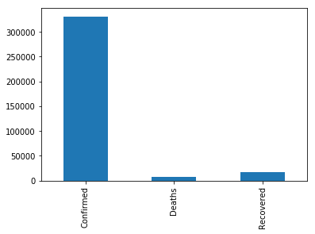


### Observations
1. The dataset is contains many countries like China, Japan, US, India and so on.
2. The comparision of confirmed with Recovered, It clearly states that the recovery action from virsu is dead slow.
3. The data clearly indicating the spreadness of virus is so fast with out any control


```python
nCov_df.columns
```


    Index(['Sno', 'Date', 'Province/State', 'Country', 'Last Update', 'Confirmed',
           'Deaths', 'Recovered'],
          dtype='object')


### Data Clean up


```python
nCov_df.info()
```

    <class 'pandas.core.frame.DataFrame'>
    RangeIndex: 1199 entries, 0 to 1198
    Data columns (total 8 columns):
    Sno               1199 non-null int64
    Date              1199 non-null object
    Province/State    888 non-null object
    Country           1199 non-null object
    Last Update       1199 non-null object
    Confirmed         1199 non-null float64
    Deaths            1199 non-null float64
    Recovered         1199 non-null float64
    dtypes: float64(3), int64(1), object(4)
    memory usage: 75.0+ KB


##### Removing the unwanted columns from tha data


```python
nCov_df.drop(['Sno', 'Last Update'], axis=1, inplace=True)
```


```python
nCov_df.columns
```


    Index(['Date', 'Province/State', 'Country', 'Confirmed', 'Deaths',
           'Recovered'],
          dtype='object')


##### Converted the date data type object into datetime


```python
nCov_df['Date'] = nCov_df['Date'].apply(pd.to_datetime)
```


```python
nCov_df.info()
```

    <class 'pandas.core.frame.DataFrame'>
    RangeIndex: 1199 entries, 0 to 1198
    Data columns (total 6 columns):
    Date              1199 non-null datetime64[ns]
    Province/State    888 non-null object
    Country           1199 non-null object
    Confirmed         1199 non-null float64
    Deaths            1199 non-null float64
    Recovered         1199 non-null float64
    dtypes: datetime64[ns](1), float64(3), object(2)
    memory usage: 56.3+ KB


```python
nCov_df['Date'].head()
```


    0   2020-01-22 12:00:00
    1   2020-01-22 12:00:00
    2   2020-01-22 12:00:00
    3   2020-01-22 12:00:00
    4   2020-01-22 12:00:00
    Name: Date, dtype: datetime64[ns]


```python
nCov_df[nCov_df['Province/State'] == 'Hong Kong']
```


<div>
<style scoped>
    .dataframe tbody tr th:only-of-type {
        vertical-align: middle;
    }

    .dataframe tbody tr th {
        vertical-align: top;
    }

    .dataframe thead th {
        text-align: right;
    }
</style>
<table border="1" class="dataframe">
  <thead>
    <tr style="text-align: right;">
      <th></th>
      <th>Date</th>
      <th>Province/State</th>
      <th>Country</th>
      <th>Confirmed</th>
      <th>Deaths</th>
      <th>Recovered</th>
    </tr>
  </thead>
  <tbody>
    <tr>
      <th>12</th>
      <td>2020-01-22 12:00:00</td>
      <td>Hong Kong</td>
      <td>China</td>
      <td>0.0</td>
      <td>0.0</td>
      <td>0.0</td>
    </tr>
    <tr>
      <th>50</th>
      <td>2020-01-23 12:00:00</td>
      <td>Hong Kong</td>
      <td>Hong Kong</td>
      <td>2.0</td>
      <td>0.0</td>
      <td>0.0</td>
    </tr>
    <tr>
      <th>108</th>
      <td>2020-01-24 12:00:00</td>
      <td>Hong Kong</td>
      <td>Hong Kong</td>
      <td>2.0</td>
      <td>0.0</td>
      <td>0.0</td>
    </tr>
    <tr>
      <th>150</th>
      <td>2020-01-25 22:00:00</td>
      <td>Hong Kong</td>
      <td>Hong Kong</td>
      <td>5.0</td>
      <td>0.0</td>
      <td>0.0</td>
    </tr>
    <tr>
      <th>193</th>
      <td>2020-01-26 23:00:00</td>
      <td>Hong Kong</td>
      <td>Hong Kong</td>
      <td>8.0</td>
      <td>0.0</td>
      <td>0.0</td>
    </tr>
    <tr>
      <th>241</th>
      <td>2020-01-27 20:30:00</td>
      <td>Hong Kong</td>
      <td>Hong Kong</td>
      <td>8.0</td>
      <td>0.0</td>
      <td>0.0</td>
    </tr>
    <tr>
      <th>296</th>
      <td>2020-01-28 23:00:00</td>
      <td>Hong Kong</td>
      <td>Hong Kong</td>
      <td>8.0</td>
      <td>0.0</td>
      <td>0.0</td>
    </tr>
    <tr>
      <th>348</th>
      <td>2020-01-29 21:00:00</td>
      <td>Hong Kong</td>
      <td>Hong Kong</td>
      <td>10.0</td>
      <td>0.0</td>
      <td>0.0</td>
    </tr>
    <tr>
      <th>404</th>
      <td>2020-01-30 21:30:00</td>
      <td>Hong Kong</td>
      <td>Hong Kong</td>
      <td>12.0</td>
      <td>0.0</td>
      <td>0.0</td>
    </tr>
    <tr>
      <th>463</th>
      <td>2020-01-31 19:00:00</td>
      <td>Hong Kong</td>
      <td>Hong Kong</td>
      <td>13.0</td>
      <td>0.0</td>
      <td>0.0</td>
    </tr>
    <tr>
      <th>530</th>
      <td>2020-02-01 23:00:00</td>
      <td>Hong Kong</td>
      <td>Hong Kong</td>
      <td>14.0</td>
      <td>0.0</td>
      <td>0.0</td>
    </tr>
    <tr>
      <th>596</th>
      <td>2020-02-02 21:00:00</td>
      <td>Hong Kong</td>
      <td>Hong Kong</td>
      <td>15.0</td>
      <td>0.0</td>
      <td>0.0</td>
    </tr>
    <tr>
      <th>663</th>
      <td>2020-02-03 21:40:00</td>
      <td>Hong Kong</td>
      <td>Hong Kong</td>
      <td>15.0</td>
      <td>0.0</td>
      <td>0.0</td>
    </tr>
    <tr>
      <th>732</th>
      <td>2020-02-04 22:00:00</td>
      <td>Hong Kong</td>
      <td>Hong Kong</td>
      <td>18.0</td>
      <td>1.0</td>
      <td>0.0</td>
    </tr>
    <tr>
      <th>802</th>
      <td>2020-02-05 12:20:00</td>
      <td>Hong Kong</td>
      <td>Hong Kong</td>
      <td>21.0</td>
      <td>1.0</td>
      <td>0.0</td>
    </tr>
    <tr>
      <th>872</th>
      <td>2020-02-06 20:05:00</td>
      <td>Hong Kong</td>
      <td>Hong Kong</td>
      <td>24.0</td>
      <td>1.0</td>
      <td>0.0</td>
    </tr>
    <tr>
      <th>942</th>
      <td>2020-02-07 20:24:00</td>
      <td>Hong Kong</td>
      <td>Hong Kong</td>
      <td>25.0</td>
      <td>1.0</td>
      <td>0.0</td>
    </tr>
    <tr>
      <th>1015</th>
      <td>2020-02-08 23:04:00</td>
      <td>Hong Kong</td>
      <td>Hong Kong</td>
      <td>26.0</td>
      <td>1.0</td>
      <td>0.0</td>
    </tr>
    <tr>
      <th>1086</th>
      <td>2020-02-09 23:20:00</td>
      <td>Hong Kong</td>
      <td>Hong Kong</td>
      <td>36.0</td>
      <td>1.0</td>
      <td>0.0</td>
    </tr>
    <tr>
      <th>1158</th>
      <td>2020-02-10 19:30:00</td>
      <td>Hong Kong</td>
      <td>Hong Kong</td>
      <td>38.0</td>
      <td>1.0</td>
      <td>0.0</td>
    </tr>
  </tbody>
</table>
</div>


##### Replacing the wrongly mapped country value towards states


```python
nCov_df[nCov_df['Province/State'] == 'Taiwan']['Country'] = 'Taiwan'
nCov_df[nCov_df['Province/State'] == 'Hong Kong']['Country'] = 'Hong Kong'
```

    /usr/local/lib/python3.5/dist-packages/ipykernel_launcher.py:1: SettingWithCopyWarning: 
    A value is trying to be set on a copy of a slice from a DataFrame.
    Try using .loc[row_indexer,col_indexer] = value instead
    
    See the caveats in the documentation: http://pandas.pydata.org/pandas-docs/stable/indexing.html#indexing-view-versus-copy
      """Entry point for launching an IPython kernel.
    /usr/local/lib/python3.5/dist-packages/ipykernel_launcher.py:2: SettingWithCopyWarning: 
    A value is trying to be set on a copy of a slice from a DataFrame.
    Try using .loc[row_indexer,col_indexer] = value instead
    
    See the caveats in the documentation: http://pandas.pydata.org/pandas-docs/stable/indexing.html#indexing-view-versus-copy
      


```python
nCov_df['Country'].unique()
```


    array(['China', 'US', 'Japan', 'Thailand', 'South Korea',
           'Mainland China', 'Hong Kong', 'Macau', 'Taiwan', 'Singapore',
           'Philippines', 'Malaysia', 'Vietnam', 'Australia', 'Mexico',
           'Brazil', 'France', 'Nepal', 'Canada', 'Cambodia', 'Sri Lanka',
           'Ivory Coast', 'Germany', 'Finland', 'United Arab Emirates',
           'India', 'Italy', 'Sweden', 'Russia', 'Spain', 'UK', 'Belgium',
           'Others'], dtype=object)


```python
nCov_df.replace({'Country': 'Mainland China'}, 'China', inplace=True)

```

#### Listing all the countries which is affected with corono virus


```python
nCov_df['Country'].unique()
```


    array(['China', 'US', 'Japan', 'Thailand', 'South Korea', 'Hong Kong',
           'Macau', 'Taiwan', 'Singapore', 'Philippines', 'Malaysia',
           'Vietnam', 'Australia', 'Mexico', 'Brazil', 'France', 'Nepal',
           'Canada', 'Cambodia', 'Sri Lanka', 'Ivory Coast', 'Germany',
           'Finland', 'United Arab Emirates', 'India', 'Italy', 'Sweden',
           'Russia', 'Spain', 'UK', 'Belgium', 'Others'], dtype=object)


### Country based virus affected people information


```python
nCov_df.columns
```


    Index(['Date', 'Province/State', 'Country', 'Confirmed', 'Deaths',
           'Recovered'],
          dtype='object')


```python
nCov_df.groupby(['Country']).Confirmed.count().reset_index().sort_values(['Country'], ascending = True)
```


<div>
<style scoped>
    .dataframe tbody tr th:only-of-type {
        vertical-align: middle;
    }

    .dataframe tbody tr th {
        vertical-align: top;
    }

    .dataframe thead th {
        text-align: right;
    }
</style>
<table border="1" class="dataframe">
  <thead>
    <tr style="text-align: right;">
      <th></th>
      <th>Country</th>
      <th>Confirmed</th>
    </tr>
  </thead>
  <tbody>
    <tr>
      <th>0</th>
      <td>Australia</td>
      <td>56</td>
    </tr>
    <tr>
      <th>1</th>
      <td>Belgium</td>
      <td>7</td>
    </tr>
    <tr>
      <th>2</th>
      <td>Brazil</td>
      <td>1</td>
    </tr>
    <tr>
      <th>3</th>
      <td>Cambodia</td>
      <td>15</td>
    </tr>
    <tr>
      <th>4</th>
      <td>Canada</td>
      <td>38</td>
    </tr>
    <tr>
      <th>5</th>
      <td>China</td>
      <td>618</td>
    </tr>
    <tr>
      <th>6</th>
      <td>Finland</td>
      <td>13</td>
    </tr>
    <tr>
      <th>7</th>
      <td>France</td>
      <td>18</td>
    </tr>
    <tr>
      <th>8</th>
      <td>Germany</td>
      <td>15</td>
    </tr>
    <tr>
      <th>9</th>
      <td>Hong Kong</td>
      <td>19</td>
    </tr>
    <tr>
      <th>10</th>
      <td>India</td>
      <td>12</td>
    </tr>
    <tr>
      <th>11</th>
      <td>Italy</td>
      <td>12</td>
    </tr>
    <tr>
      <th>12</th>
      <td>Ivory Coast</td>
      <td>1</td>
    </tr>
    <tr>
      <th>13</th>
      <td>Japan</td>
      <td>20</td>
    </tr>
    <tr>
      <th>14</th>
      <td>Macau</td>
      <td>19</td>
    </tr>
    <tr>
      <th>15</th>
      <td>Malaysia</td>
      <td>18</td>
    </tr>
    <tr>
      <th>16</th>
      <td>Mexico</td>
      <td>1</td>
    </tr>
    <tr>
      <th>17</th>
      <td>Nepal</td>
      <td>17</td>
    </tr>
    <tr>
      <th>18</th>
      <td>Others</td>
      <td>4</td>
    </tr>
    <tr>
      <th>19</th>
      <td>Philippines</td>
      <td>13</td>
    </tr>
    <tr>
      <th>20</th>
      <td>Russia</td>
      <td>11</td>
    </tr>
    <tr>
      <th>21</th>
      <td>Singapore</td>
      <td>19</td>
    </tr>
    <tr>
      <th>22</th>
      <td>South Korea</td>
      <td>20</td>
    </tr>
    <tr>
      <th>23</th>
      <td>Spain</td>
      <td>11</td>
    </tr>
    <tr>
      <th>24</th>
      <td>Sri Lanka</td>
      <td>15</td>
    </tr>
    <tr>
      <th>25</th>
      <td>Sweden</td>
      <td>11</td>
    </tr>
    <tr>
      <th>26</th>
      <td>Taiwan</td>
      <td>19</td>
    </tr>
    <tr>
      <th>27</th>
      <td>Thailand</td>
      <td>20</td>
    </tr>
    <tr>
      <th>28</th>
      <td>UK</td>
      <td>11</td>
    </tr>
    <tr>
      <th>29</th>
      <td>US</td>
      <td>113</td>
    </tr>
    <tr>
      <th>30</th>
      <td>United Arab Emirates</td>
      <td>13</td>
    </tr>
    <tr>
      <th>31</th>
      <td>Vietnam</td>
      <td>19</td>
    </tr>
  </tbody>
</table>
</div>


#### Top most Severely affected countries


```python
nCov_df.groupby(['Country']).Confirmed.count().reset_index().sort_values(['Confirmed'], ascending=False).head(10)
```


<div>
<style scoped>
    .dataframe tbody tr th:only-of-type {
        vertical-align: middle;
    }

    .dataframe tbody tr th {
        vertical-align: top;
    }

    .dataframe thead th {
        text-align: right;
    }
</style>
<table border="1" class="dataframe">
  <thead>
    <tr style="text-align: right;">
      <th></th>
      <th>Country</th>
      <th>Confirmed</th>
    </tr>
  </thead>
  <tbody>
    <tr>
      <th>5</th>
      <td>China</td>
      <td>618</td>
    </tr>
    <tr>
      <th>29</th>
      <td>US</td>
      <td>113</td>
    </tr>
    <tr>
      <th>0</th>
      <td>Australia</td>
      <td>56</td>
    </tr>
    <tr>
      <th>4</th>
      <td>Canada</td>
      <td>38</td>
    </tr>
    <tr>
      <th>13</th>
      <td>Japan</td>
      <td>20</td>
    </tr>
    <tr>
      <th>27</th>
      <td>Thailand</td>
      <td>20</td>
    </tr>
    <tr>
      <th>22</th>
      <td>South Korea</td>
      <td>20</td>
    </tr>
    <tr>
      <th>26</th>
      <td>Taiwan</td>
      <td>19</td>
    </tr>
    <tr>
      <th>21</th>
      <td>Singapore</td>
      <td>19</td>
    </tr>
    <tr>
      <th>14</th>
      <td>Macau</td>
      <td>19</td>
    </tr>
  </tbody>
</table>
</div>


##### List all the Provinces/States that were affected with Virus


```python
nCov_df.columns
```


    Index(['Date', 'Province/State', 'Country', 'Confirmed', 'Deaths',
           'Recovered'],
          dtype='object')


```python
nCov_df['Province/State'].unique()
```


    array(['Anhui', 'Beijing', 'Chongqing', 'Fujian', 'Gansu', 'Guangdong',
           'Guangxi', 'Guizhou', 'Hainan', 'Hebei', 'Heilongjiang', 'Henan',
           'Hong Kong', 'Hubei', 'Hunan', 'Inner Mongolia', 'Jiangsu',
           'Jiangxi', 'Jilin', 'Liaoning', 'Macau', 'Ningxia', 'Qinghai',
           'Shaanxi', 'Shandong', 'Shanghai', 'Shanxi', 'Sichuan', 'Taiwan',
           'Tianjin', 'Tibet', 'Washington', 'Xinjiang', 'Yunnan', 'Zhejiang',
           nan, 'Chicago', 'Illinois', 'California', 'Arizona', 'Ontario',
           'New South Wales', 'Victoria', 'Bavaria', 'British Columbia',
           'Queensland', 'Chicago, IL', 'South Australia', 'Boston, MA',
           'Los Angeles, CA', 'Orange, CA', 'Santa Clara, CA', 'Seattle, WA',
           'Tempe, AZ', 'Toronto, ON', 'San Benito, CA', 'London, ON',
           'Madison, WI', 'Cruise Ship', 'Diamond Princess cruise ship'],
          dtype=object)


##### Impact in india


```python
nCov_df[nCov_df.Country == 'India']

```


<div>
<style scoped>
    .dataframe tbody tr th:only-of-type {
        vertical-align: middle;
    }

    .dataframe tbody tr th {
        vertical-align: top;
    }

    .dataframe thead th {
        text-align: right;
    }
</style>
<table border="1" class="dataframe">
  <thead>
    <tr style="text-align: right;">
      <th></th>
      <th>Date</th>
      <th>Province/State</th>
      <th>Country</th>
      <th>Confirmed</th>
      <th>Deaths</th>
      <th>Recovered</th>
    </tr>
  </thead>
  <tbody>
    <tr>
      <th>432</th>
      <td>2020-01-30 21:30:00</td>
      <td>NaN</td>
      <td>India</td>
      <td>1.0</td>
      <td>0.0</td>
      <td>0.0</td>
    </tr>
    <tr>
      <th>491</th>
      <td>2020-01-31 19:00:00</td>
      <td>NaN</td>
      <td>India</td>
      <td>1.0</td>
      <td>0.0</td>
      <td>0.0</td>
    </tr>
    <tr>
      <th>552</th>
      <td>2020-02-01 23:00:00</td>
      <td>NaN</td>
      <td>India</td>
      <td>1.0</td>
      <td>0.0</td>
      <td>0.0</td>
    </tr>
    <tr>
      <th>611</th>
      <td>2020-02-02 21:00:00</td>
      <td>NaN</td>
      <td>India</td>
      <td>2.0</td>
      <td>0.0</td>
      <td>0.0</td>
    </tr>
    <tr>
      <th>675</th>
      <td>2020-02-03 21:40:00</td>
      <td>NaN</td>
      <td>India</td>
      <td>3.0</td>
      <td>0.0</td>
      <td>0.0</td>
    </tr>
    <tr>
      <th>745</th>
      <td>2020-02-04 22:00:00</td>
      <td>NaN</td>
      <td>India</td>
      <td>3.0</td>
      <td>0.0</td>
      <td>0.0</td>
    </tr>
    <tr>
      <th>815</th>
      <td>2020-02-05 12:20:00</td>
      <td>NaN</td>
      <td>India</td>
      <td>3.0</td>
      <td>0.0</td>
      <td>0.0</td>
    </tr>
    <tr>
      <th>885</th>
      <td>2020-02-06 20:05:00</td>
      <td>NaN</td>
      <td>India</td>
      <td>3.0</td>
      <td>0.0</td>
      <td>0.0</td>
    </tr>
    <tr>
      <th>958</th>
      <td>2020-02-07 20:24:00</td>
      <td>NaN</td>
      <td>India</td>
      <td>3.0</td>
      <td>0.0</td>
      <td>0.0</td>
    </tr>
    <tr>
      <th>1030</th>
      <td>2020-02-08 23:04:00</td>
      <td>NaN</td>
      <td>India</td>
      <td>3.0</td>
      <td>0.0</td>
      <td>0.0</td>
    </tr>
    <tr>
      <th>1102</th>
      <td>2020-02-09 23:20:00</td>
      <td>NaN</td>
      <td>India</td>
      <td>3.0</td>
      <td>0.0</td>
      <td>0.0</td>
    </tr>
    <tr>
      <th>1175</th>
      <td>2020-02-10 19:30:00</td>
      <td>NaN</td>
      <td>India</td>
      <td>3.0</td>
      <td>0.0</td>
      <td>0.0</td>
    </tr>
  </tbody>
</table>
</div>


### Exploratory Analysis

#### Country most affected


```python
nCov_df.groupby(['Country']).Confirmed.max().reset_index().sort_values(['Confirmed'], ascending=False).head(20).plot(x='Country',
                                                                                                                      kind='bar', figsize=(12,6))
```


    <matplotlib.axes._subplots.AxesSubplot at 0x7ff50ee255c0>


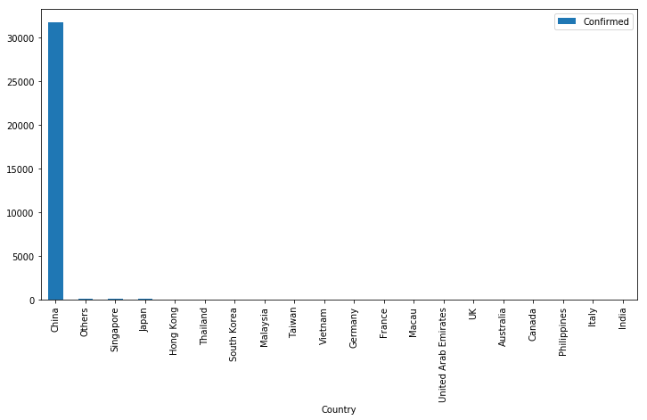


#### Country most recovered


```python
nCov_df.groupby(['Country']).Recovered.max().reset_index().sort_values(['Recovered'], ascending=False).head(20).plot(x='Country',
                                                                                                                      kind='bar', figsize=(12,6))
```


    <matplotlib.axes._subplots.AxesSubplot at 0x7ff50ed7f4e0>


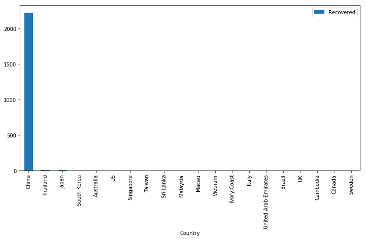


#### Country faced more deaths over the world


```python
nCov_df.groupby(['Country']).Deaths.max().reset_index().sort_values(['Deaths'], ascending=False).head(20).plot(x='Country',
                                                                                                                      kind='bar', figsize=(12,6))
```


    <matplotlib.axes._subplots.AxesSubplot at 0x7ff50ed011d0>


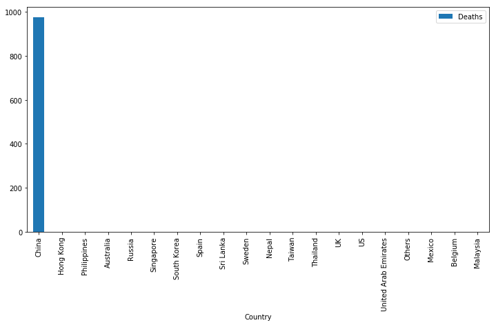


### Recovery vs Deaths in world wide


```python
nCov_df[['Country', 'Deaths', 'Recovered']].groupby('Country').max().plot(kind='bar', figsize=(12, 7))
```


    <matplotlib.axes._subplots.AxesSubplot at 0x7ff50e481128>


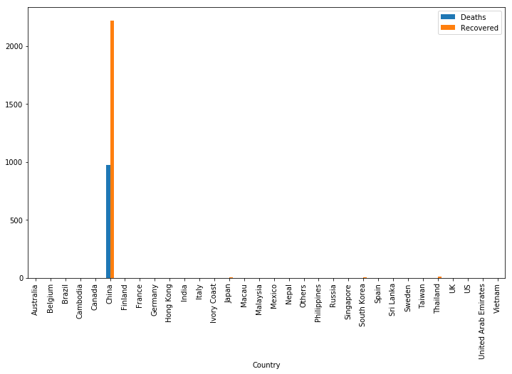


### Recovery vs Deaths in world wide other than China


```python
nCov_df[nCov_df['Country'] != 'China'][['Country', 'Deaths', 'Recovered']].groupby('Country').max().plot(kind='bar', figsize=(12, 7))
```


    <matplotlib.axes._subplots.AxesSubplot at 0x7ff50e3c4358>


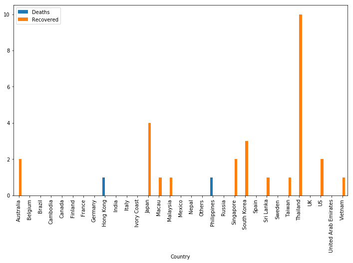


```python
nCov_df['Country'].unique()
```


    array(['China', 'US', 'Japan', 'Thailand', 'South Korea', 'Hong Kong',
           'Macau', 'Taiwan', 'Singapore', 'Philippines', 'Malaysia',
           'Vietnam', 'Australia', 'Mexico', 'Brazil', 'France', 'Nepal',
           'Canada', 'Cambodia', 'Sri Lanka', 'Ivory Coast', 'Germany',
           'Finland', 'United Arab Emirates', 'India', 'Italy', 'Sweden',
           'Russia', 'Spain', 'UK', 'Belgium', 'Others'], dtype=object)


#### Philippines clearly show that the no recovered happen


```python
nCov_df[nCov_df['Country'] == 'Philippines'][['Country', 'Confirmed', 'Deaths', 'Recovered']].groupby('Country').max().plot(kind='bar')
```


    <matplotlib.axes._subplots.AxesSubplot at 0x7ff50a4f16d8>


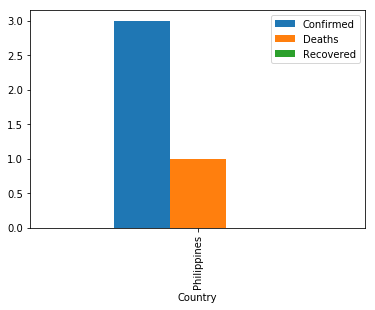


#### When did Virus Confirmed initially?


```python
nCov_df['Date'].min()
```


    Timestamp('2020-01-22 12:00:00')


#### When was the Virus Confirmed recently?


```python
nCov_df['Date'].max()
```


    Timestamp('2020-02-10 19:30:00')


#### How many total no.of persons were identified with Virus on each day


```python
nCov_df.groupby('Date')[['Confirmed', 'Deaths', 'Recovered']].max().reset_index()

```


<div>
<style scoped>
    .dataframe tbody tr th:only-of-type {
        vertical-align: middle;
    }

    .dataframe tbody tr th {
        vertical-align: top;
    }

    .dataframe thead th {
        text-align: right;
    }
</style>
<table border="1" class="dataframe">
  <thead>
    <tr style="text-align: right;">
      <th></th>
      <th>Date</th>
      <th>Confirmed</th>
      <th>Deaths</th>
      <th>Recovered</th>
    </tr>
  </thead>
  <tbody>
    <tr>
      <th>0</th>
      <td>2020-01-22 12:00:00</td>
      <td>444.0</td>
      <td>0.0</td>
      <td>0.0</td>
    </tr>
    <tr>
      <th>1</th>
      <td>2020-01-23 12:00:00</td>
      <td>444.0</td>
      <td>17.0</td>
      <td>28.0</td>
    </tr>
    <tr>
      <th>2</th>
      <td>2020-01-24 12:00:00</td>
      <td>549.0</td>
      <td>24.0</td>
      <td>31.0</td>
    </tr>
    <tr>
      <th>3</th>
      <td>2020-01-25 22:00:00</td>
      <td>1052.0</td>
      <td>52.0</td>
      <td>42.0</td>
    </tr>
    <tr>
      <th>4</th>
      <td>2020-01-26 23:00:00</td>
      <td>1423.0</td>
      <td>76.0</td>
      <td>44.0</td>
    </tr>
    <tr>
      <th>5</th>
      <td>2020-01-27 20:30:00</td>
      <td>2714.0</td>
      <td>100.0</td>
      <td>47.0</td>
    </tr>
    <tr>
      <th>6</th>
      <td>2020-01-28 23:00:00</td>
      <td>3554.0</td>
      <td>125.0</td>
      <td>80.0</td>
    </tr>
    <tr>
      <th>7</th>
      <td>2020-01-29 21:00:00</td>
      <td>4586.0</td>
      <td>162.0</td>
      <td>90.0</td>
    </tr>
    <tr>
      <th>8</th>
      <td>2020-01-30 21:30:00</td>
      <td>5806.0</td>
      <td>204.0</td>
      <td>116.0</td>
    </tr>
    <tr>
      <th>9</th>
      <td>2020-01-31 19:00:00</td>
      <td>7153.0</td>
      <td>249.0</td>
      <td>169.0</td>
    </tr>
    <tr>
      <th>10</th>
      <td>2020-02-01 23:00:00</td>
      <td>9074.0</td>
      <td>294.0</td>
      <td>215.0</td>
    </tr>
    <tr>
      <th>11</th>
      <td>2020-02-02 21:00:00</td>
      <td>11177.0</td>
      <td>350.0</td>
      <td>295.0</td>
    </tr>
    <tr>
      <th>12</th>
      <td>2020-02-03 21:40:00</td>
      <td>13522.0</td>
      <td>414.0</td>
      <td>396.0</td>
    </tr>
    <tr>
      <th>13</th>
      <td>2020-02-04 22:00:00</td>
      <td>16678.0</td>
      <td>479.0</td>
      <td>522.0</td>
    </tr>
    <tr>
      <th>14</th>
      <td>2020-02-05 12:20:00</td>
      <td>16678.0</td>
      <td>479.0</td>
      <td>538.0</td>
    </tr>
    <tr>
      <th>15</th>
      <td>2020-02-06 20:05:00</td>
      <td>22112.0</td>
      <td>618.0</td>
      <td>817.0</td>
    </tr>
    <tr>
      <th>16</th>
      <td>2020-02-07 20:24:00</td>
      <td>22112.0</td>
      <td>618.0</td>
      <td>867.0</td>
    </tr>
    <tr>
      <th>17</th>
      <td>2020-02-08 23:04:00</td>
      <td>27100.0</td>
      <td>780.0</td>
      <td>1440.0</td>
    </tr>
    <tr>
      <th>18</th>
      <td>2020-02-09 23:20:00</td>
      <td>29631.0</td>
      <td>871.0</td>
      <td>1795.0</td>
    </tr>
    <tr>
      <th>19</th>
      <td>2020-02-10 19:30:00</td>
      <td>31728.0</td>
      <td>974.0</td>
      <td>2222.0</td>
    </tr>
  </tbody>
</table>
</div>


#### Case confirmed for each countries


```python
nCov_df.groupby(['Country']).Confirmed.max().reset_index().plot(x='Country', kind='bar', figsize=(10,6))
```


    <matplotlib.axes._subplots.AxesSubplot at 0x7ff50e994550>


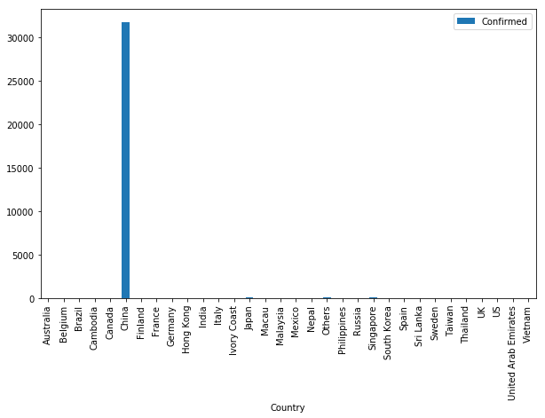


#### Case confirmed other than China


```python
nCov_df[nCov_df['Country'] != 'China'].groupby(['Country']).Confirmed.max().reset_index().plot(x='Country', kind='bar', figsize=(10,6))
```


    <matplotlib.axes._subplots.AxesSubplot at 0x7ff50e940cc0>


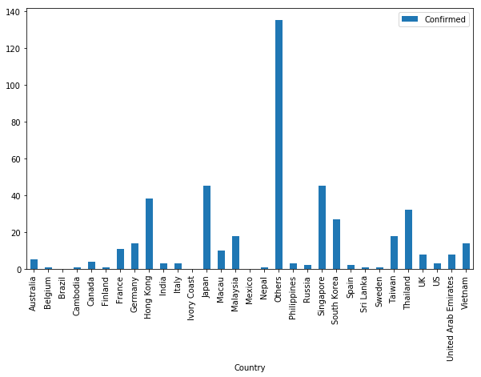


### The virus spreadness over the confirmed, Deaths and Recovered in globally


```python
nCov_df.groupby('Date')[['Confirmed', 'Deaths', 'Recovered']].max().reset_index().plot(x='Date',
                                                                                      y=['Confirmed', 'Deaths', 'Recovered'],
                                                                                      figsize=(12, 7))

```


    <matplotlib.axes._subplots.AxesSubplot at 0x7ff50e862080>


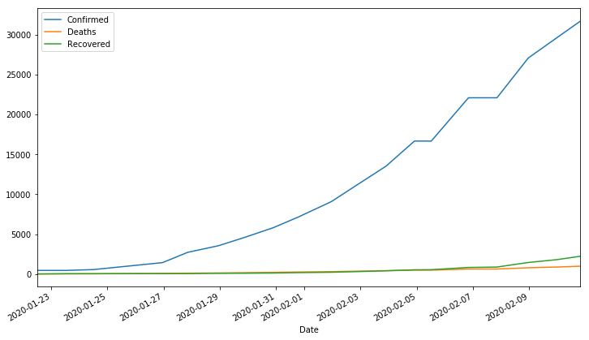


#### Spreadness of virus , Deaths and recovery data other than China


```python
nCov_df[nCov_df['Country'] != 'China'].groupby('Date')[['Confirmed', 'Deaths', 'Recovered']].max().reset_index().plot(x='Date',
                                                                                      y=['Confirmed', 'Deaths', 'Recovered'],
                                                                                      figsize=(12, 7))

```


    <matplotlib.axes._subplots.AxesSubplot at 0x7ff50e832438>


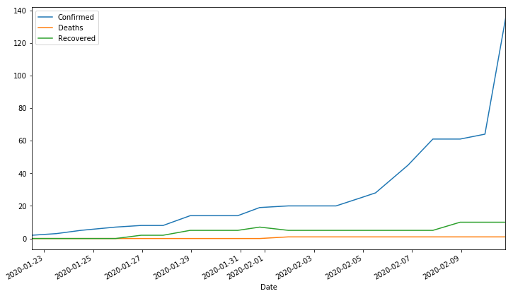


#### List the States in China which were affected


```python
nCov_df.columns
```


    Index(['Date', 'Province/State', 'Country', 'Confirmed', 'Deaths',
           'Recovered'],
          dtype='object')


```python
nCov_df[nCov_df['Country'] == 'China'].groupby('Province/State')[['Confirmed']].count().reset_index().plot(x='Province/State',
                                                                                      y=['Confirmed'],kind='bar',
                                                                                      figsize=(12, 7))

```


    <matplotlib.axes._subplots.AxesSubplot at 0x7ff50e696860>


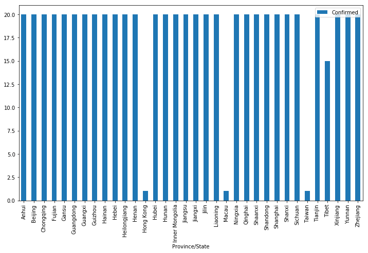


```python
nCov_df[nCov_df.Country == 'China'][['Province/State', 'Deaths', 'Recovered']].groupby('Province/State').max().plot(kind='bar',
                                                                                                                   figsize=(12, 7))
```


    <matplotlib.axes._subplots.AxesSubplot at 0x7ff50e80fcf8>


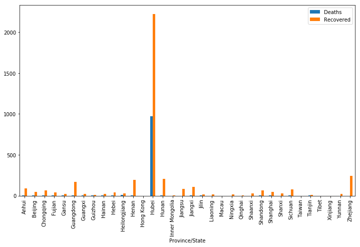


```python
nCov_df[nCov_df['Country'] == 'China'].groupby('Province/State')[['Confirmed', 'Deaths', 'Recovered']].max().reset_index().plot(x='Province/State',
                                                                                      y=['Confirmed', 'Deaths', 'Recovered'],
                                                                                      figsize=(12, 7))

```


    <matplotlib.axes._subplots.AxesSubplot at 0x7ff50e809588>


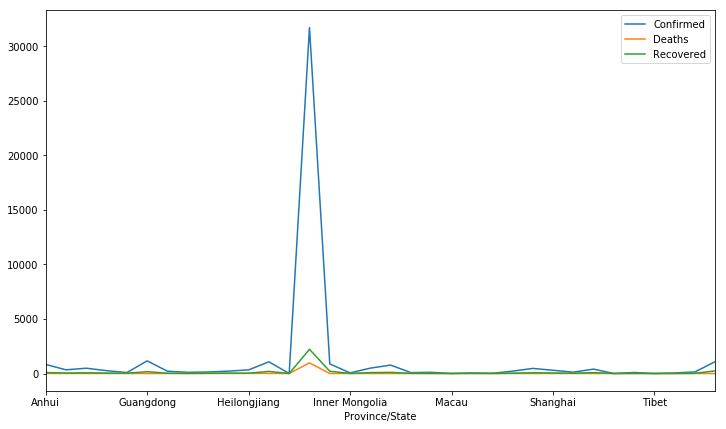


```python
nCov_df.columns
```


    Index(['Date', 'Province/State', 'Country', 'Confirmed', 'Deaths',
           'Recovered'],
          dtype='object')


#### Countries those have worst recovery services 


```python
nCov_df[nCov_df['Recovered'] < nCov_df['Deaths']][['Country', 'Confirmed', 'Deaths', 'Recovered']].groupby('Country').max().plot(kind='bar')
```


    <matplotlib.axes._subplots.AxesSubplot at 0x7ff509e11828>


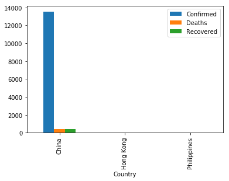


#### Countries death rate high and 0 recovery rate


```python
nCov_df[(nCov_df['Recovered'] < nCov_df['Deaths'])&(nCov_df['Country'] != 'China')][['Country', 'Confirmed', 'Deaths', 'Recovered']].groupby('Country').max().plot(kind='bar',
figsize=(12,7))
```


    <matplotlib.axes._subplots.AxesSubplot at 0x7ff509fc4f28>


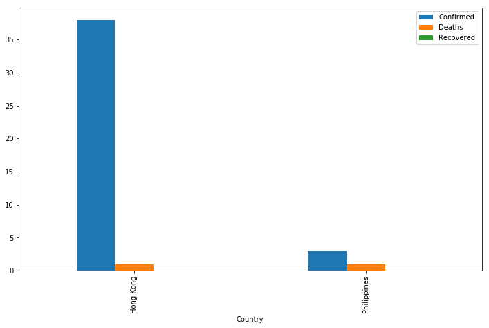


```python
nCov_df[(nCov_df['Recovered'] == 0 )&( nCov_df['Deaths'] != 0)][['Country', 'Confirmed', 'Deaths', 'Recovered']].groupby('Country').max().plot(kind='bar')
```


    <matplotlib.axes._subplots.AxesSubplot at 0x7ff509d96d68>


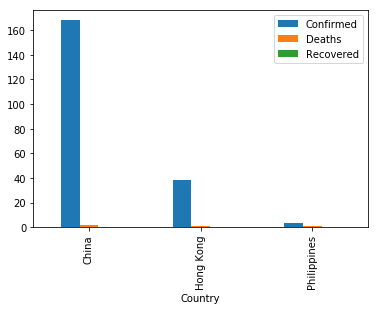


#### Very slow recovery in china


```python
nCov_df[(nCov_df['Country'] == 'China') & (nCov_df['Recovered'] == 0 )&( nCov_df['Deaths'] != 0)][['Province/State', 'Confirmed', 'Deaths', 'Recovered']].groupby('Province/State').max().plot(kind='bar',
figsize=(12, 7))
```


    <matplotlib.axes._subplots.AxesSubplot at 0x7ff509c989e8>


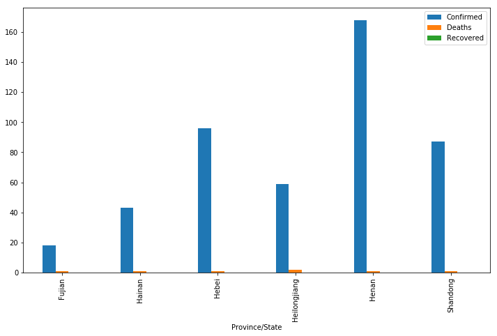


```python

```
